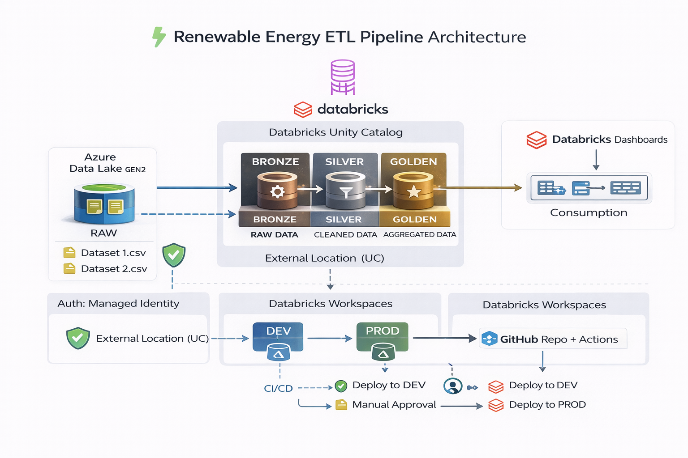

<div align="center">

# ⚡ Renewable Energy Generation Analytics ETL Pipeline
### Arquitectura Medallion en Azure Databricks

[](https://databricks.com/)
[](https://azure.microsoft.com/)
[](https://spark.apache.org/)
[](https://delta.io/)
[](https://docs.databricks.com/en/data-governance/unity-catalog/index.html)
[](https://github.com/features/actions)

*Pipeline analítico para evaluación del desempeño de activos de generación renovable usando arquitectura Medallion, Unity Catalog y CI/CD completo.*

</div>

---

## 🎯 Descripción

Proyecto orientado al análisis del desempeño operativo de centrales de generación renovable, integrando datos de producción energética e información hidrológica para construir indicadores estratégicos como:

- Producción total por central
- Factor de planta (Capacity Factor)
- Disponibilidad operativa
- Impacto de indisponibilidades
- Análisis comparativo por periodo

Se implementa una arquitectura Medallion en Azure Databricks para transformar datos crudos almacenados en Azure Data Lake (ADLS Gen2) hasta generar tablas optimizadas para consumo analítico y dashboards ejecutivos.

---

## 🏛️ Arquitectura

### Flujo de Datos

```
📄 CSV (Azure Data Lake - RAW)
    ↓
🥉 Bronze Layer (Ingesta sin transformación)
    ↓
🥈 Silver Layer (Limpieza + Reglas de negocio)
    ↓
🥇 Golden Layer (KPIs y agregaciones optimizadas)
    ↓
📊 Databricks Dashboards
```



---

## ⚙️ Workflow ETL


### Estructura del Workflow

1. **PrepAmb**
   - Preparación de entorno
   - Validación de catálogo y esquemas
   - Inicialización de parámetros

2. **Ingesta Paralela Bronze**
   - ingest_generation
   - ingest_hydrology

3. **Transform**
   - Limpieza y normalización
   - Integración entre datasets
   - Aplicación de reglas de negocio

4. **Load**
   - Construcción de KPIs
   - Agregaciones optimizadas
   - OPTIMIZE + ZORDER

5. **Grants**
   - Asignación de permisos en Unity Catalog
   - Control de acceso por roles

---

## 📦 Capas del Pipeline

### 🥉 Bronze
- Datos crudos desde ADLS
- Persistencia en formato Delta
- Inclusión de metadatos de ingesta

### 🥈 Silver
- Validaciones
- Eliminación de duplicados
- Cast de tipos
- Integración de datasets
- Estandarización de columnas

### 🥇 Golden
- KPIs de desempeño energético
- Agregaciones por central y periodo
- Tablas optimizadas para BI
- Alto rendimiento en consultas

---

## 📁 Estructura del Proyecto

```
renewable-energy-etl/
│
├── .github/workflows/
│   └── deploy.yml
│
├── notebooks/
│   ├── Preparacion_ambiente.py
│   ├── Ingest_hydro_generation_bronze.py
│   ├── Ingest_hydrology_bronze.py
│   ├── Transform.py
│   ├── Load.py
│   └── Grants.py
│
├── workflows/
│   └── etl_workflow.json
│
├── reversion/
│   └── Drop_Medallion.py
│
├── Medallion_architecture_FinalProject.png
├── Workflow_completed.png
└── README.md
```

---

## 🛠️ Tecnologías

| Tecnología | Propósito |
|------------|-----------|
| Azure Databricks | Procesamiento distribuido con Spark |
| Delta Lake | Storage ACID y optimización |
| PySpark | Transformación de datos |
| Azure Data Lake Gen2 | Capa RAW |
| Unity Catalog | Gobernanza y seguridad |
| GitHub Actions | Automatización CI/CD |

---

## 🔐 Seguridad y Gobernanza

- Acceso a ADLS mediante Managed Identity
- Uso de Unity Catalog
- Separación de entornos Dev / Prod
- Control de acceso basado en roles

---

## 🚀 Ejecución

1. Cargar archivos CSV en ADLS (contenedor RAW)
2. Validar permisos de Managed Identity
3. Ejecutar Workflow en entorno Dev
4. Validar capa Silver y Golden
5. Promover cambios a Producción vía GitHub

---

## 👤 Autor

**Proyecto Final – Ingeniería de Datos con Databricks**  
Arquitectura Medallion | Azure | PySpark | CI/CD

---

<div align="center">

**Proyecto Académico – Arquitectura Medallion en Azure Databricks**

</div>
